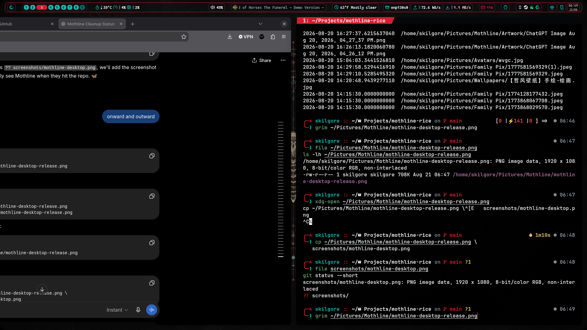

# Mothline

A red-and-teal CachyOS rice built around Niri, Noctalia v5, Kitty, Fastfetch,
Zsh, and a matching Firefox start page.

Mothline uses a near-black foundation, bone-white text, blood-red structure,
teal highlights, restrained glass surfaces, and a recurring moth emblem.

## Included

- Niri 26.04 layout, animation, rules, keybinds, blur, and gradient borders
- Noctalia v5 palette, bar, launcher, notifications, and lock screen
- GTK 3/4 styling for Thunar, Nautilus, and legacy GTK applications
- Qt6ct plus Noctalia KColorScheme integration for Qt 6/KDE applications
- Tela Red Dark system icons and optional Papirus-Dark Claws Mail icons
- Kitty theme plus a dedicated Fastfetch popup profile
- Fastfetch layout with NVIDIA, network, and optional PIA status
- Fluxer Canary Mothline CSS theme
- Obsidian Mothline CSS snippet
- Mothline SDDM theme and login-screen assets
- Responsive start page with military time and Open-Meteo weather
- Mothline lock-screen wallpaper and avatar
- Zsh installer with timestamped backups and a restoration script

## Preview



Additional desktop, lock-screen, terminal, launcher, and start-page screenshots
can be added under `screenshots/`. Avoid screenshots containing notifications,
email addresses, public IP addresses, calendar events, or private browser tabs.

## Requirements

Core applications:

```zsh
sudo pacman -S --needed niri kitty fastfetch zsh git curl jq
```

Install Noctalia v5 using its current official installation instructions.
The configuration expects `noctalia msg ...` IPC commands, not legacy
`qs -c noctalia ipc call ...` commands.

Recommended official-repository extras:

```zsh
sudo pacman -S --needed ttf-jetbrains-mono-nerd starship fzf \
  zsh-autosuggestions zsh-syntax-highlighting kdeconnect nautilus \
  thunar breeze age rclone exfatprogs
```

Recommended AUR packages:

```zsh
paru -S adw-gtk-theme nwg-look qt6ct-kde tela-icon-theme \
  papirus-claws-mail-theme-git
```

## Install

Clone the repository and run the Zsh installer:

```zsh
git clone https://github.com/wetw3rx/Mothline-Rice.git
cd mothline-rice
./install.zsh
```

The installer backs up existing Niri, Noctalia, GTK, Qt6ct, Kitty,
Fastfetch, Fluxer, Obsidian theme state, start-page, SDDM staging, and
Mothline asset directories beneath:

```text
~/.local/state/mothline-backups/
```

It runs `niri validate` after installation when Niri is available.

## Personalize before daily use

1. Run `niri msg outputs`, then edit `~/.config/niri/cfg/display.kdl`.
   The repository ships with its sample output disabled so it cannot apply an
   incorrect mode or monitor position.
2. Edit the identity, time zone, city, coordinates, and preferred links in
   `~/.local/share/startpage/start.html`.
3. If using Google Calendar, copy `examples/calendar.toml` to
   `~/.config/noctalia/calendar.toml`, replace `you@example.com`, and enable the
   account. Never commit your edited calendar file.
4. Use Noctalia lock-screen widget edit mode to reposition widgets for your
   connector names and resolutions:

   ```zsh
   noctalia msg lockscreen-widgets-edit
   ```

5. Set Firefox's home page to:

   ```text
   file:///home/YOUR-USER/.local/share/startpage/start.html
   ```

6. In Noctalia Settings -> Templates, enable GTK 3, GTK 4, and KColorScheme,
   then run `noctalia msg templates-apply`.
7. Open `qt6ct`, select Breeze and the `noctalia` KColorScheme, then log out
   and back in so `QT_QPA_PLATFORMTHEME=qt6ct` takes effect.
8. Use `Tela-red-dark` as the GTK icon theme. Claws Mail can optionally use
   Papirus-Dark under Configuration -> Preferences -> Display -> Themes.

## Documentation

Additional guides are available in `docs/`:

- `Noctalia-v5-Recovery.md` — stuck-toast recovery and **Nocta v5 Restart** launcher

- `Mothline_3-2-1_Backup_Guide.pdf`
- `Mothline-Backup-and-GitHub-FAQ.pdf`
- `Mothline-Tips-and-Tricks-Niri-Fullscreen.pdf`

The SDDM source tree is included under `config/sddm-mothline/`. The main
installer first stages it beneath `~/.local/share/mothline-sddm`, then offers
an explicit opt-in system installation. Declining leaves the staged copy intact
for later review.

The privileged installer resolves theme assets relative to its own file
location rather than using `$HOME`, because sudo may change `$HOME` to
`/root`. It backs up an existing installed theme, applies root ownership and
safe permissions, verifies essential files, and offers to configure SDDM. It
does not restart SDDM automatically; save active work and reboot or restart the
display manager only after verification.

Manual system installation:

```bash
sudo "$HOME/.local/share/mothline-sddm/install.sh"
```

A failed sudo authentication or source validation must not be treated as a
successful installation. Confirm the installed theme and active SDDM
configuration before rebooting.

## Backup

Use a 3-2-1 strategy: one local archive, one verified offline USB copy, and one
encrypted off-site copy. Encrypt archives with `age`, keep the passphrase in a
password manager, and verify each copy. Never commit archives, passphrases,
rclone configuration, browser profiles, or private mail configuration.

The installer's backup is for quick rollback, not off-device protection.

## Zsh

The installer places `fastfetch-popup` in `~/.local/bin`. The included
`shell/zshrc.example` documents the tested Zsh, Starship, and Fastfetch setup;
it is not installed automatically because replacing a shell configuration is
too invasive.

To launch Fastfetch automatically in each interactive Zsh, add:

```zsh
if [[ -o interactive && -z "${FASTFETCH_SHOWN:-}" ]]; then
  export FASTFETCH_SHOWN=1
  command -v fastfetch >/dev/null 2>&1 && fastfetch
fi
```

## Restore

Pass the backup directory printed by the installer:

```zsh
./restore.zsh ~/.local/state/mothline-backups/install-YYYYMMDD-HHMMSS
```

## Publishing to GitHub

Create an empty public repository named `mothline-rice`, without adding a
README or license on GitHub. Then run from this project directory:

```zsh
git init
git branch -M main
git add .
git diff --cached --check
git commit -m "Initial Mothline rice"
git remote add origin https://github.com/wetw3rx/Mothline-Rice.git
git push -u origin main
```

Review `git diff --cached` before committing. In particular, confirm there are
no email addresses, credentials, coordinates you consider private, public IPs,
or screenshots with personal information.

## License

MIT

## NeoMutt and Neovim mail composer

Mothline includes a portable Neovim mail-composition profile under `config/nvim/`.

It provides the native charcoal, red, and teal colorscheme; spelling and 72-column email formatting; styled headers, replies, and signatures; a `MOTHLINE // MAIL COMPOSER` statusline; Which-Key; Zen Mode; and pinned plugin versions.

The installer backs up an existing `~/.config/nvim`. Use the printed backup path with `restore.zsh` to recover the earlier configuration.

NeoMutt accounts are deliberately excluded. Configure them locally, then set:

```neomutt
set editor="/usr/bin/nvim"
set edit_headers=yes
```

Saving in Neovim returns to NeoMutt; it does not send. Review the message in NeoMutt before pressing `y`.

Never commit mail accounts, passwords, OAuth data, signatures, Bitwarden sessions, mailboxes, caches, or temporary drafts.
